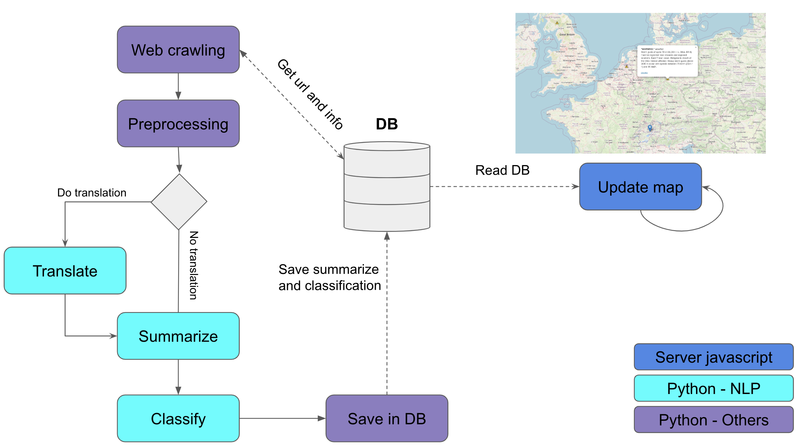

# HackZürich 2022
Repository for the HackZürich 2022 edition (September 16 - 18, 2022).

## Description

Supply chains are subject to disruptions of various types: climate disaster, socio-economical and political events, and so on. Such events can cause the shortages of goods in our supermarkets. To react quickly to such events, or better yet, to anticipate them, Migros could use a software that automatically scans for such threats and keeps the company aware.

Our **migros' monitor system** (monigros) uses advanced Natural Language Processing (NLP) Machine Learning models to translate and analyse news articles freshly fetched from the web, and classify each notion as a threat for our local company. Threats are displayed through our web interface, which provides a summary of the news the NLP model has read and a link to such resources, as well as a classification of the information.

We fatch the news articles from trusted URLs. We use [Huggingface's](https://www.huggingface.co) pre-trained models to translate, summarize and classify news articles. Only articles that are classified as a threat are displayed in our web  [React](https://www.reactjs.org) interface. The web interface shows a world map ([react-leaflet](https://react-leaflet.js.org/)) with annotations on suppliers which are at risk of some sort of shortage / raise in products price.



### Start webpage
- To execute the server and interact with the map, execute in the web folder:
``` bash 
  npm start 
```
The map is update it in real after we process a new url.
### DB operations
Commands to interact with the database
- Read tables of the DB
``` bash 
  python DB_read_table.py --name_db NAME_DB
```
- Insert trust url to check information from. The format of the url can be html or xml
``` bash 
  python DB_insert_url.py --url URL --format_url FORMAT --country COUNTRY
```
Also you can add for a translation for the url with the command --translation TRANSLATION. (Only translation available ger_en)

### Process url
Process an url to update the dashboard map. Download the webpage, make a resume and classify its importance. 
``` bash 
  python process_url.py --url_id URL_ID
```
To get the url_id of a specific trust url, you can execute
``` bash 
  python DB_read_table.py --name_db Trust_sources
```


## Authors
[BrianPulfer](https://github.com/BrianPulfer) and [ipmach](https://github.com/ipmach).
